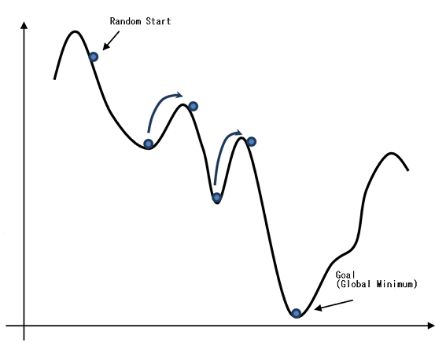

Resource Allocation using Optimization Algorithms
================


Resource allocation or resource management is a very difficult task in
any company. To find the best resource with the right skills for the a
specific project with certain requirements.

It takes a lot of time and effort to do this task manually. Here we are
going to appraoch this problem using **Machine Learning Optimization
Algorithms** and **Python**.

Import necessary libraries:

``` python
import pandas as pd
from string import ascii_lowercase
import random 
import numpy as np
from itertools import compress
import math
```

Define a random dataset with random resource skills and project
prerequisites. We will create 50 projects and 100 resources. Each
project needs 2 resources.

*N.B. There is no perfect solution for this dataset. The algorithm will
try to find the best partial solution with the most minimal cost as
possible*

``` python
resource = [random.choice(ascii_lowercase) + str(_) for _ in range(100)]
project = [random.choice(ascii_lowercase) + random.choice(ascii_lowercase) +
           str(_) for _ in range(50)]

lang_skill = ["R", "Python", "Scala", "Julia"]
db_skill = ["PSQL", "MySQL", "MongoDB", "Neo4j", "CouchDB"]

random.seed(1311)
resources = pd.DataFrame({
        "name" : resource,
        "skill1" : random.choices(lang_skill, k = 100),
        "skill2" : random.choices(db_skill, k = 100)
            })

projects = pd.DataFrame({
        "project" : project,
        "skill1" : random.choices(lang_skill, k = 50),
        "skill2" : random.choices(db_skill, k = 50)
        })
        
print(resources.head())
print("#########")
print(projects.head())

#   name  skill1   skill2
# 0   y0       R    Neo4j
# 1   g1  Python  MongoDB
# 2   e2   Julia  CouchDB
# 3   n3   Julia     PSQL
# 4   s4       R    MySQL
# #########
#   project  skill1   skill2
# 0     kr0       R  CouchDB
# 1     ns1   Scala  CouchDB
# 2     dw2       R     PSQL
# 3     at3  Python  CouchDB
# 4     wg4   Scala     PSQL
```

Now we need a function to display the solution the algorithm will give
us.

``` python
def schedule_display(sol):
    res = []
    proj = []
    resskill = []
    projskill = []
    slots = []
    # create two slots for each project
    for i in range(len(projects)): slots += [i, i]

    # Loop over resources assignment
    for i in range(len(sol)):
        # get slot
        x = int(sol[i])
        # get resource name
        res.append(resources.name[i])
        # project name
        pr = projects.project[slots[x]]
        # append to project list
        proj.append(pr)
        # get resources skill
        resskill.append(list(resources.iloc[i, 1:]))
        # to get the project skills from the name we need to get the indices
        # where the project is equal to "pr" then slice the projects df
        pr_bool = projects.project == pr
        pr_ind = list(compress(range(len(pr_bool)), pr_bool))
        projskill.append(list(projects.iloc[pr_ind, 1:].values[0]))
        # remove this slot in order not to be filled again
        del slots[x]
    
    res_proj = pd.DataFrame({"Resource" : res, "Project" : proj,
                             "Res_Skill" : resskill,
                             "Proj_Skill" : projskill})
                             
    return res_proj.sort_values("Project")
```

Let’s see a random allocation what it suggests;

``` python
rand_sch = schedule_display([0 for _ in range(len(resources))])
print(rand_sch)

#    Resource Project          Res_Skill        Proj_Skill
# 90      g90    aw45   [Julia, MongoDB]     [Julia, PSQL]
# 91      q91    aw45   [Julia, MongoDB]     [Julia, PSQL]
# 76      l76    bv38   [Scala, MongoDB]  [Julia, CouchDB]
# 77      h77    bv38     [Julia, Neo4j]  [Julia, CouchDB]
# 43      e43    cv21     [Scala, Neo4j]  [Scala, MongoDB]
# ..      ...     ...                ...               ...
# 31      d31    yi15     [Scala, MySQL]    [Julia, MySQL]
# 24      h24    zm12  [Python, CouchDB]  [Julia, CouchDB]
# 25      h25    zm12     [Scala, Neo4j]  [Julia, CouchDB]
# 73      m73    zm36         [R, MySQL]     [Julia, PSQL]
# 72      i72    zm36         [R, Neo4j]     [Julia, PSQL]
# 
# [100 rows x 4 columns]
```

The **Cost Function** is the most important part in any *optimization
algorithm*. The algorithm searches different solutions in order to
minimize the cost function of the current solution until it reaches the
stop criteria.

Here we define our cost function which calculates how mismatching the
assigned resource’s skills with the project requirements. It increases
by 1 if the resource has 1 out of 2 from the requirements, 2 if the
resource doesn’t have any required skill and 0 if the resource is the
perfect match.

###### N.B. Here we try to teach the algorithm to at least find one required skill in each assigned resource. We can be more strict and search for the two resources that perfectly cover the required skills.

``` python
def resproj_cost(sol):
  cost = 0
  # create list a of slots
  slots = []
  for i in range(len(projects)): slots += [i, i]
  
  # loop over each resource
  for i in range(len(sol)):
      x = int(sol[i])
      # get project skills and resources skills
      proj = np.array(projects.iloc[slots[x], 1:])
      res = np.array(resources.iloc[i, 1:])
      # count how many mismatches among skills (0, 1 or 2)
      cost += sum(res != proj)
      
      # remove selected slot
      del slots[x]
    
  return cost
```

### Simulated Annealing

Simulated annealing algorithm is an optimization method which is
inspired by the slow cooling of metals. The algorithm starts with a
random solution to the problem. It has a variable called temperature,
which starts very high and gradually gets lower (cool down). In each
iteration, a random number from the current solution is chosen and
changed in a given direction. The cost is calculated before and after
the change, and the two costs are compared. If the new cost is lower,
the new solution becomes the current solution, just like any other
optimization algorithm. However, if the cost is higher, the algorithm
can still accept the current solution with a certain probability. *This
is to avoid the local minimum.*

As shown in the picture, the algorithms sometimes accept worse solution
to escape from the local minima and go for the goal **(Global Minimum)**



Define the Simulated Annealing algorithm;

``` python
def simulated_annealing(domain, costf, temp = 10000.0,
                     cool = 0.95, step = 1):
    # initialize the values randomly
    current_sol = [float(random.randint(domain[i][0], domain[i][1])) for i in range(len(domain))]
    while temp > 0.1:
        # choose one of the indices
        i = random.randint(0, len(domain) - 1)
        
        # choose a direction to change it
        direction = random.randint(- step, step)
        
        # create a new list with one of the values changed
        new_sol = current_sol[:]
        new_sol[i] += direction
        if new_sol[i] < domain[i][0]: new_sol[i] = domain[i][0]
        elif new_sol[i] > domain[i][1]: new_sol[i] = domain[i][1]
        
        # calculate the current cost and the new cost
        current_cost = costf(current_sol)
        new_cost = costf(new_sol)
        #p = pow(math.e, (- new_cost - current_cost) / temp)
        p = math.e ** (( - new_cost - current_cost) / temp)
        
        # is it better, or does it make the probability
        # cutoff?
        if (new_cost < current_cost or random.random() < p):
            current_sol = new_sol
            print(new_cost)
        
        # decrease the temperature
        temp = temp * cool
    return current_sol
```

Run the algorithm. Start first with a random solution and pass it to the
algorithm.

N.B. How the cost can get higher in certain iterations.

``` python
# random solution (start point)
solution = [(0, (len(projects) * 2) - i - 1) for i in range(0, len(projects) * 2)]

# step = 3 to widen the direction of movement and high cool to run the algorithm longer
schedule = simulated_annealing(solution, resproj_cost, step = 3, cool = 0.99)

# 151
# 151
# 152
# 152
# 153
# 152
# 159
# 160
# 160
# 160
# ...
# ...
# 
# 148
# 147
# 147
# 145
# 145
# 145
# 145
# 144
# ...
# ...
# 
# 102
# 101
# 100
# 99
# 98
# 97
```

Now we have a variable that has an optimized schedule. Let’s display it.

``` python
schedule_df = schedule_display(schedule)
print(schedule_df.head(20))

#    Resource Project          Res_Skill         Proj_Skill
# 91      q91    aw45   [Julia, MongoDB]      [Julia, PSQL]
# 14      l14    aw45      [Julia, PSQL]      [Julia, PSQL]
# 3        r3    bv38      [Julia, PSQL]   [Julia, CouchDB]
# 77      h77    bv38     [Julia, Neo4j]   [Julia, CouchDB]
# 26      n26    cv21   [Scala, MongoDB]   [Scala, MongoDB]
# 82      n82    cv21     [Scala, MySQL]   [Scala, MongoDB]
# 32      v32    db27  [Python, MongoDB]  [Python, MongoDB]
# 90      g90    db27   [Julia, MongoDB]  [Python, MongoDB]
# 47      z47     dh6   [Scala, MongoDB]   [Scala, MongoDB]
# 41      a41     dh6          [R, PSQL]   [Scala, MongoDB]
# 49      a49    di46          [R, PSQL]      [Scala, PSQL]
# 31      d31    di46     [Scala, MySQL]      [Scala, PSQL]
# 56      q56     dn1      [Scala, PSQL]   [Scala, CouchDB]
# 36      z36     dn1  [Python, MongoDB]   [Scala, CouchDB]
# 33      u33    dv33   [Julia, CouchDB]   [Julia, CouchDB]
# 52      f52    dv33   [Scala, CouchDB]   [Julia, CouchDB]
# 6        q6    ex35     [Julia, Neo4j]          [R, PSQL]
# 46      z46    ex35       [R, MongoDB]          [R, PSQL]
# 74      u74    fi20     [Scala, Neo4j]     [Scala, Neo4j]
# 18      d18    fi20      [Scala, PSQL]     [Scala, Neo4j]
```

The assignments are much better than the random chosen one. The
algorithm can be tweaked and improved more and more using different
criteria for the cost function.
